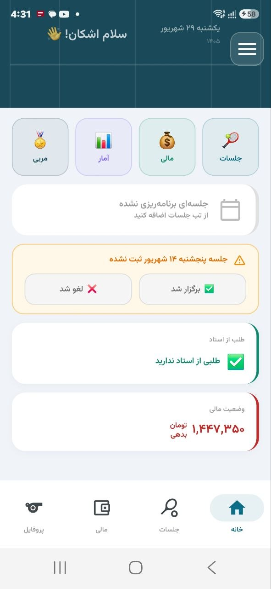
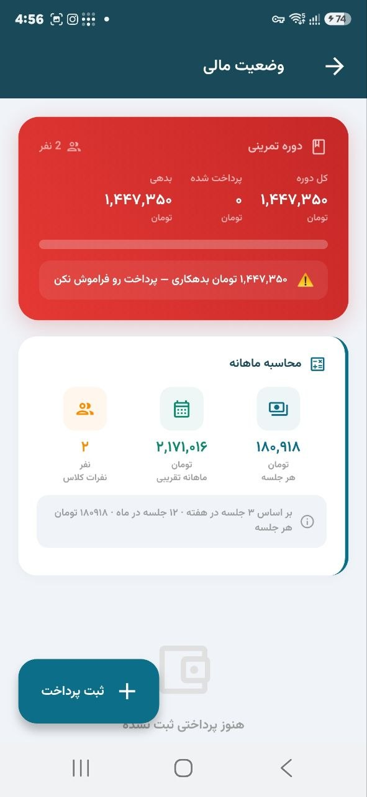
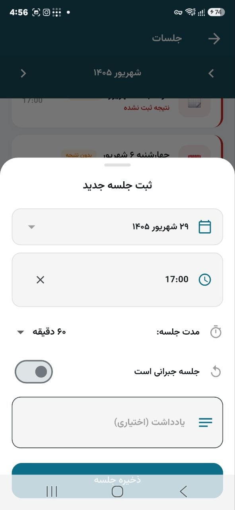
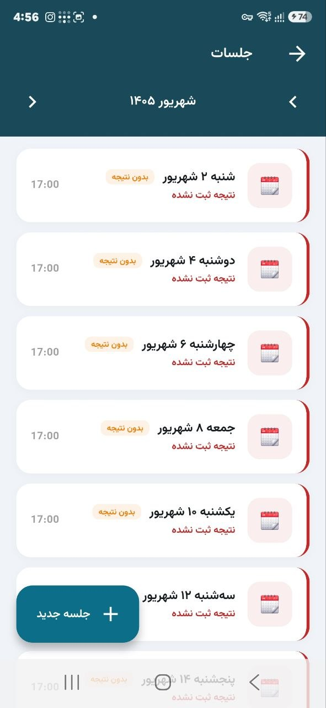
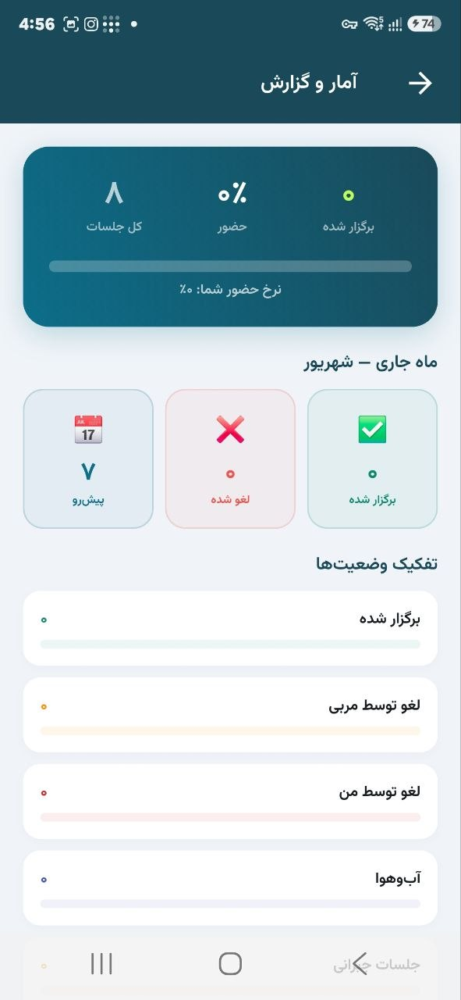

# Tennis Manager

A Persian-first Flutter app for tracking a tennis player's training sessions, packages, payments, and coaching details on Android.

[](https://github.com/ashkanmardan/tennis-manager/actions/workflows/flutter-ci.yml) [](LICENSE) [](https://github.com/ashkanmardan/tennis-manager/issues)

The CI badge reflects GitHub's actual workflow state after this branch is merged; local checks are recorded in the [readiness report](OPEN_SOURCE_READINESS_REPORT.md).

## Overview

Tennis Manager helps Persian-speaking players record training packages, scheduled sessions, payments, reports, and coach information. The UI is right-to-left and uses Jalali dates. The current code is primarily a **single-player training tracker**; older design documents describe broader student/coach management ideas that are not all implemented.

## Features

- Persian RTL interface and Jalali calendar helpers
- Local SQLite storage for profile, packages, sessions, and payments
- Reports and JSON backup export/restore screen
- Shareable backups through Android's share sheet

## Download and screenshots

Download the verified Android release from [GitHub Releases](https://github.com/ashkanmardan/tennis-manager/releases/latest). The older APK in [`releases/TennisApp-release.apk`](releases/TennisApp-release.apk) is retained only as historical material and is not the current distribution binary. See [release process](docs/RELEASING.md) and the [release notes](docs/releases/v1.0.1.md).

The following screenshots were captured from the real v1.0.1 Android app with sample data:

| Home | Finance | Session form |
| --- | --- | --- |
|  |  |  |

| Sessions | Reports |
| --- | --- |
|  |  |

Profile screenshots with visible phone and card numbers are intentionally excluded. See the [screenshot notes](docs/screenshots/README.md).

## Requirements and installation

- Flutter **3.47.1** with Dart **3.13.1** is the locally inspected toolchain and CI target. `pubspec.yaml` allows Dart `>=3.0.0 <4.0.0`; older Flutter versions have not been validated.
- Android SDK with API 36 and JDK 21 for builds. The Gradle files request `compileSdk 36`; Flutter 3.47.1's defaults set minimum API 24 (Android 7.0) and target API 36. v1.0.1 has been tested on one real Android device for installation and core onboarding; broader device compatibility and the full backup/upgrade matrix remain under validation.
- An Android device or emulator for running the UI.

```bash
git clone https://github.com/ashkanmardan/tennis-manager.git
cd tennis-manager
flutter pub get
flutter run
```

For a complete environment checklist, see [installation](docs/INSTALLATION.md).

## Development and testing

```bash
flutter analyze
flutter test
dart format --output=none --set-exit-if-changed test
flutter build apk --debug
```

The repository contains a Gradle wrapper for Android builds. Release signing is intentionally configured outside public source; follow [releasing](docs/RELEASING.md) before distributing a release APK. CI validates on pushes to `main` and pull requests. See [testing](docs/TESTING.md) for known gaps.

## Project structure and architecture

`lib/core/` contains themes and date/formatting helpers, `lib/data/` contains SQLite models and repositories, and `lib/presentation/` contains the UI. `android/` contains the Android host project. `test/` contains focused logic tests. The nested `lib/lib/` tree is an older duplicate and remains under audit; it is not the entry point. See [architecture](docs/ARCHITECTURE.md) and the [open source audit](docs/OPEN_SOURCE_AUDIT.md).

## Data, privacy, and localization

The app stores data in a local SQLite database. Export writes a JSON backup to app-specific external storage, then opens Android sharing; selecting another app can send that backup off-device. Profile links can open Instagram in an external app or browser. Review [privacy details](docs/PRIVACY.md) before using real personal data.

The application currently forces Persian (`fa_IR`) and RTL layout. Jalali conversions are provided by `shamsi_date` and local helpers. English UI localization is not yet implemented.

## Community

- [Contributing](CONTRIBUTING.md), [Code of Conduct](CODE_OF_CONDUCT.md), and [roadmap](ROADMAP.md)
- [Report a bug or request a feature](https://github.com/ashkanmardan/tennis-manager/issues/new/choose)
- [Report a security issue privately](SECURITY.md)
- [Changelog](CHANGELOG.md)

## License and maintainer

Original project code, documentation, and launcher icon artwork are licensed under the [MIT License](LICENSE), copyright (c) 2026 Ashkan Mardanpour. The maintainer confirmed that they designed the launcher icons. Bundled Vazirmatn fonts are under the SIL Open Font License 1.1; see [third-party notices](NOTICE.md).

Maintained by [Ashkan Mardanpour](https://github.com/ashkanmardan).
